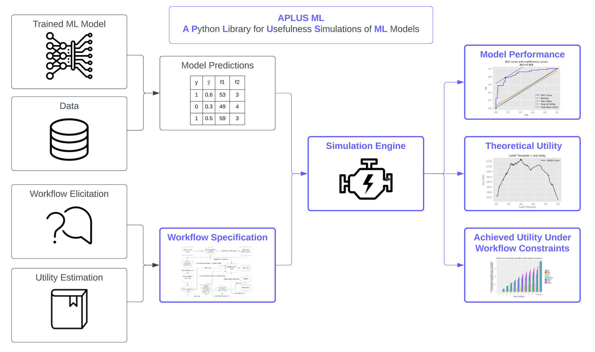

Background
===========

.. toctree::
   :maxdepth: 2
   :caption: Background

APLUS ML (**A** **P**\ ython **L**\ ibrary for **U**\ sefulness **S**\ imulations of **M**\ achine **L**\ earning Models) is a simulation framework for conducting usefulness assessments of machine learning models in workflows, as originally published in this `2023 JBI paper <https://www.sciencedirect.com/science/article/pii/S1532046423000400?via%3Dihub>`_.

It aims to quantitatively answer the question: *If I use this ML model within this workflow, will the benefits outweigh the costs, and by how much?*

**APLUS** was originally developed for clinical workflows in healthcare settings. However, APLUS is a applicable to any workflow that involves a model making decisions on a stream of datapoints, and we encourage contributors from any domain to use and extend APLUS.

Motivation
----------

Despite rapid advancements in machine learning (ML) for healthcare, model deployment remains limited as traditional ML evaluation metrics (e.g., AUROC, F1 Score) fail to account for the complexities of real-world workflows such as staffing constraints, resource limitations, treatment heterogeneity, and variable patient flow.

These operational conditions can greatly distort the realized impact of introducing an ML model into a clinical setting.

**APLUS** addresses this problem by evaluating ML models under realistic workflow constraints via simulation.

Components
-----------

Below, we provide a high-level overview of the **three components** of APLUS. We provide a more formal specification of the concepts underlying APLUS on the :doc:`/usage/config` page.

1. Simulation
^^^^^^^^^^^^^^^^^^^^^^^
APLUS uses discrete-event simulation to model workflows.

Each patient's journey through the workflow is represented as an ordered sequence of states over evenly-spaced time steps, which enables modeling cycles and resource-dependent prioritization (e.g., Stage IV cancer patients receiving preferential access to treatment over Stage II patients). 

Transitions between states can be determined probabilistically or via conditional expressions, which enables modeling heterogeneous treatment effects, patient subpopulations, and system-level resource constraints.

APLUS outputs a structured dictionary that contains the full history of the simulation (e.g. states, transitions, achieved utilities, etc.) to enable arbitrary downstream analyses.

2. Configuration
^^^^^^^^^^^^^^^^^^^^^^^^^^^^^^^^^^^^
APLUS represents workflows as a **state machine** specified via a **YAML** config file. The config consists of three sections:  

1. **Metadata** - Essential initialization details, such as:

    * Workflow name  
    * Paths to required files (e.g., CSV files with model predictions)  
    * Column mappings for tabular data (e.g. which column in a CSV corresponds to patient IDs)

2. **Variables** – Parameters of the simulation. There are four types of variables:

    * **Simulation-Level Variables**: Tracked by the simulation engine itself and measure the progression of time within the simulation. (e.g. the number of timesteps the simulation has run, the duration of time that a patient has been in a state, etc.).  
    * **Patient-Level Properties**: Unique, individual-level properties associated with each patient(e.g., age, cancer stage, ML model predictions).  
    * **System-Level Resources**: Attributes of the overall system shared across all patients (e.g., MRI availability, budget, specialist capacity).  
    * **Constants**: Fixed values. These can be any primitive Python type (integer, float, string, or boolean) or basic Python data structure (list, dict, set).

3. **States** – The steps of the workflow. There are three types of states:

    * **Start**: Where all patients begin their journey through the workflow. There is always exactly 1 start state.
    * **Intermediate**: Transition points within the workflow. There can be 0+ intermediate states.
    * **End**: Terminal states, which indicate the completion of the workflow. There must be 1+ end states.

3. Visualization
^^^^^^^^^^^^^^^^^^^^^^^^^^^^^^^^^^^^
APLUS has a set of predefined visualizations for workflows which are generated using **Graphviz**.

Definitions
-----------
Here, we provide a more detailed specification of the concepts underlying the APLUS simulation framework.

Simulation
^^^^^^^^^^^^^^^^^^^^

We use discrete event simulation to simulate our workflow :math:`W`. 

In other words, we represent the world as occuring through a set of discrete, evenly spaced timesteps :math:`\lambda = 0, 1,...,N`. Each timestep :math:`\lambda` could represent a second, minute, hour, day, etc., the interpretation is up to the user.

Events :math:`A` and :math:`B` that occur within the same timestep :math:`\lambda` can have arbitrary ordering if there does not exist a strict :math:`A \rightarrow B` or :math:`B \rightarrow A` dependency between these events. In other words, if 3 patients have an MRI and 2 patients have a blood test on timestep :math:`\lambda = 3`, then assuming none of these events are dependent on each other, the ordering in which the blood tests and MRIs occur will be random.

A **"duration"** refers to a number of timesteps (i.e. a length of time).

Workflow
^^^^^^^^^^^^^^^^^^^^
A workflow :math:`W` is simply a set of states :math:`S`.

States
"""""""""""""""""
Each state :math:`s \in S` has associated with it:

1. A duration :math:`\lambda_s` representing how many timesteps an agent will wait in this state before transitioning to another state
2. A set of utilities :math:`U_s`
3. A set of resource deltas :math:`R_s \subseteq R` that specify how various resources :math:`r \in R_s` change when an agent arrives at this state
4. A set of transitions :math:`T_s \subseteq T`
5. A type :math:`\tau_s \in \{\text{start}, \text{normal}, \text{end}\}`

Invariants:

* :math:`|\{ s \in S | \tau_s = \text{start} \}| = 1`
* :math:`\forall s \in S` such that :math:`\tau_s = \text{start}, |T_s| > 0`
* :math:`\forall s \in S` such that :math:`\tau_s = \text{normal}, |T_s| > 0`
* :math:`\forall s \in S` such that :math:`\tau_s = \text{end}, |T_s| = 0`

Transitions
"""""""""""""""""
Given the set of all transitions :math:`T`, each transition :math:`t \in T_s \subseteq T` has associated with it:

1. A source state :math:`s \in S`
2. A destination state :math:`s' \in S` (where :math:`s'` could be the same as :math:`s`)
3. A duration :math:`\lambda_t` representing how many timesteps an agent will wait, after having chosen this transition :math:`t`, before moving to state :math:`s'`
4. A condition :math:`c_t \in C` that, only when TRUE, allows the agent to take this transition :math:`t` to state :math:`s'`
5. A set of utilities :math:`U_t`
6. A set of resource deltas :math:`R_t \subseteq R` that specify how various resources :math:`r \in R_t` change after an agent takes this transition

Utilities
"""""""""""""""""
Given the set of all utilities :math:`U`, each utility :math:`u \in U` has associated with it:

1. A value :math:`u_v \in \mathbb{R}` representing the numeric value of this utility
2. A unit :math:`u_u` (i.e. QALYs, US dollars, years, etc.)
3. A condition :math:`c_u \in C` that, only when TRUE, has the simulation record that this utility value :math:`u_v` for unit :math:`u_u` was achieved

Conditions
"""""""""""""""""
A condition :math:`c \in C` determines whether a utility or transition can be taken. A condition :math:`c` can take the form of either:

1. A probability (in which case :math:`\{ c \in \mathbb{R} | 0 \le c \le 1 \}`); OR
2. An arbitrary Python expression which evaluates to TRUE or FALSE

Resources
"""""""""""""""""
A resource :math:`r \in R` is a constrained resource that is shared across all patients. This represents a hospital-level constraint of a workflow (i.e. fiscal budget, number of nurses, MRI machine availability, etc.). Each resource :math:`r` has associated with it:

1. A level :math:`r_l \in \mathbb{N}` which represents the current value of the resource
2. An initial amount :math:`r_i \in \mathbb{N}` which ensures :math:`r_l = r_i` when :math:`\lambda = 0`
3. An maximum capacity :math:`r_m \in \mathbb{N}` which ensures that :math:`r_l \le r_m`
4. A refill amount :math:`r_a \in \mathbb{N}` that represents how much this resource gets increased after :math:`\lambda_r` timesteps have elapsed since the last refill
5. A refill duration :math:`\lambda_r \in \mathbb{N}` that represents how many timesteps must elapse before the resource is increased to a value of :math:`\max{r_l + r_a, r_m}`

.. important::
   In order to decrement a resource, you need to specify a **resource delta** on the relevant state/transition. Otherwise, if you just require that ``nurse_capacity > 0`` for a transition, then the simulation will not automatically decrement ``nurse_capacity`` by 1 when that transition is taken (which can be surprising to some users). This is often a cause of infinite loops, or situations where changing the :math:`r_i`, :math:`r_m`, or :math:`r_a` of a resource has no effect on the model's achieved utility.

Patients
^^^^^^^^^^
Each patient :math:`p \in P` has associated with it:

1. A start timestep :math:`\lambda_p` representing the timestep of the simulation at which the patient began progressing through the workflow (i.e. the day that the patient was admitted to the hospital)
2. A current state :math:`s_p \in S`. The patient always starts at a state :math:`s_p` where :math:`\tau_{s_p} = \text{start}`
3. A set of **properties** :math:`\rho_p` which can be anything (integers, floats, strings, dictionaries, lists, etc.)
4. A **history** object :math:`H_p` which captures all of the past states, transitions, and utilities that the patient achieved.

Running a Simulation
^^^^^^^^^^^^^^^^^^^^

Each patient :math:`p` starts his/her workflow at the state :math:`s`, where :math:`\tau_s = \text{start}`. Note: This is the same for all patients.

Each patient :math:`p` starts his/her workflow at timestep :math:`\lambda_p`. Note: This varies across all patients.

Each patient :math:`p` then progresses through the states of the workflow, according to the applicable transitions and conditions. The patient stops their journey when either of the following conditions are met:

* The patient reaches a state :math:`s` where :math:`\tau_s = \text{end}`; OR
* The simulation is terminated prematurely after a set number of timesteps have occurred