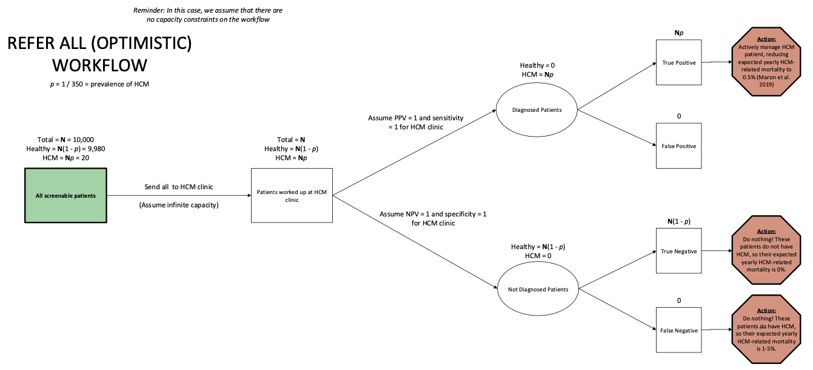
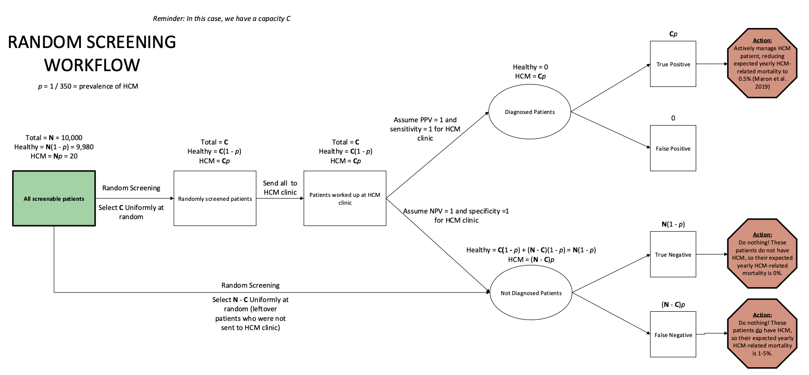
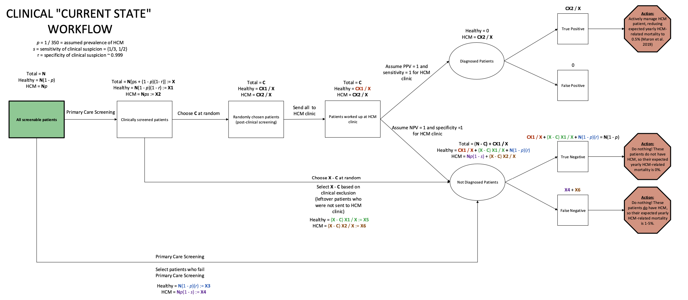
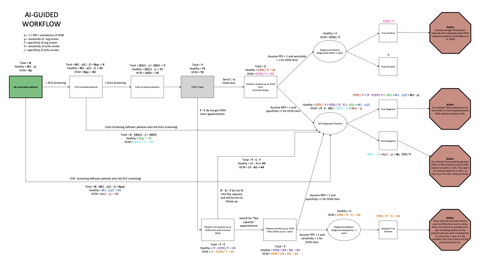

Tutorial (HCM)
================

.. toctree::
   :maxdepth: 2
   :caption: Tutorial (HCM)

In this section, we use APLUS to evaluate a Hypertrophic Cardiomyopathy (HCM) workflow.

The full ``.ipynb`` notebook for this tutorial can be found `at this link <https://github.com/som-shahlab/aplusml/blob/main/tutorials/hcm.ipynb>`_.

🏥 Clinical Motivation
----------------------

The goal of this project is to evaluate the clinical, resource utilization, financial, and ethical impact of possible deployment of a Hypertrophic Cardiomyopathy (HCM) ML detection model.

🤖 ML Models
-------------

We consider an ML model that combines ECG and Echo screening to detect HCM.

👩‍⚕️ Workflows
----------------

We were given four possible HCM workflows to consider.

We also considered two baseline workflows. The first is the **optimistic** workflow, where all patients are referred to the specialist without any sort of screening or capacity constraints.

The second is the **random** workflow, where patient's are randomly referred to the specialist.

First, we considered the **current state** of HCM care, where patients are referred to the specialist by a primary care physician.

Next, we considered an **AI-guided** workflow, where the patient's EHR is reviewed by an AI to determine if they are a candidate for HCM workup.

🔧 Creating the APLUS Config
----------------------------

Let's now create our config files, one for each workflow. 

We'll start with the **optimistic** workflow, then the **random** workflow, then the **current state** workflow, and finally the **AI-guided** workflow.

For each workflow, we'll start by defining all of the steps in the workflow as states in our YAML file. We'll then add any variables needed for the workflow, then show the full config file at the bottom.

1. Current Workflow
^^^^^^^^^^^^^^^^^^^^^^^^^

For reference, here is the **current state** workflow that we're trying to replicate in APLUS:

We'll start by defining all of the steps in the workflow as states in our YAML file.

Our first state is called "All screenable patients" (in green), which is just our `start` state. Let's add this state to our YAML file.

.. code-block:: yaml

  states:
    start:
      type: start
      label: "Start"
      transitions:
        - dest: prescreen_patients

It will immediately transition to the "Clinically screened patients" state, which performs a clinical screening of the patient's EHR.

.. code-block:: yaml

  states:
    # ... existing states ...
    prescreen_patients: # Clinical pre-screened patients
      label: "Clinical screened patients"
      transitions:
        - dest: screen_patients
          if: (has_hcm and (clinical_result <=  clinical_sensitivity)) or (not has_hcm and (clinical_result >= clinical_specificity))
        - dest: undiagnosed

These patients will either be sent to the "Not Diagnosed Patients" state (if they do not have HCM), or will be sent to the a queue that randomly selects patients to be screened by the HCM clinic.

Note that ``has_hcm`` is a variable of type **property** that we'll need to set for each patient in our simulation. It will be ``TRUE`` if the patient has HCM, and ``FALSE`` otherwise.
Similarly, ``clinical_result`` is another variable of type **property** that will be set uniformly for each patient to a random number between 0 and 1, representing the result of the clinical screening.
Finally, ``clinical_sensitivity`` and ``clinical_specificity`` are **scalar** variables that will be set to the sensitivity and specificity of the clinical screening, respectively. These are fixed constants that are shared across all patients.

.. code-block:: yaml

  states:
    # ... existing states ...
    screen_patients:
      label: "Screened patients"
      transitions:
        - dest: visit_hcm_clinic
          if: hcm_clinic_capacity > 0
          resource_deltas: # Decrement the capacity of the HCM clinic when a patient is seen
            hcm_clinic_capacity: -1
        - dest: undiagnosed

This state will arbitrarily send the first `hcm_clinic_capacity` patients to the HCM clinic, and the rest to the "Not Diagnosed Patients" state.

We will define the `hcm_clinic_capacity` variable later as a **resource** that is decremented each time a patient is seen at the HCM clinic, and refreshed at the end of each day.

For patients that make it to the HCM clinic, they are split into two groups: Diagnosed and Not Diagnosed. 

We'll assume that this split is done perfectly by the HCM clinic, i.e. all patients with HCM (as marked by a patient-level property `has_hcm`) are diagnosed and all patients without HCM are undiagnosed.

.. code-block:: yaml

  states:
    # ... existing states ...
    visit_hcm_clinic:
      label: "Patients worked up at HCM clinic"
      transitions:
        - dest: diagnosed
          if: has_hcm
        - dest: undiagnosed

Next, we create states for the diagnosed / undiagnosed patients.

.. code-block:: yaml

  states:
    # ... existing states ...
    diagnosed:
      label: "Diagnosed"
      transitions:
        - dest: untreated
    undiagnosed:
      label: "Undiagnosed"
      transitions:
        - dest: untreated

Finally, we create end states for each of the four possible outcomes (True Positive, False Positive, True Negative, False Negative) and assign utility values to each.

Our main utility is the 5-yr risk of HCM-related death for each patient. We'll assume the following mortality rates:
  * True Positives: Annual mortality = 0.5%
  * Delayed True Positives (for **AI-guided** workflow): Annual mortality = 5% the first year, 0.5% thereafter
  * False Negatives: Annual mortality = 5%
  * True Negatives: Annual mortality = 0%
  * False Positives: Annual mortality = 0%

.. code-block:: yaml

  states:
    # ... existing states ...
    true_positive:
      type: end
      label: "True Positive"
      utilities:
        - value: 0.995**5 # 0.5% annual ortality for 5 years
          unit: five_year_life_expectancy
    false_positive:
      type: end
      label: "False Positive"
      utilities:
        - value: 1
          unit: five_year_life_expectancy
    true_negative:
      type: end
      label: "True Negative"
      utilities:
        - value: 1
          unit: five_year_life_expectancy
    false_negative:
      type: end
      label: "False Negative"
      utilities:
        - value: 0.95**5 # 5% annual mortality for 5 years
          unit: five_year_life_expectancy

Let's finish this config by adding relevant variables to the config. 

We'll assume the HCM clinic can see 2 patients per day, and that the clinical screening has 95% sensitivity and specificity.

.. code-block:: yaml

  variables:

  variables:
    # Patient properties
    has_hcm:
      type: property # Boolean property that is true if the patient has HCM
      value: None # this will be overwritten by our Python script
    clinical_result: # Used for determining if the patient is positive for clinical screening
      type: property
      distribution: uniform
      start: 0
      end: 1
    # Fixed constants
    clinical_sensitivity:
      value: 0.95 # Sensitivity of clinical screening ('s' in the diagram)
    clinical_specificity:
      value: 0.95 # Specificity of clinical screening ('r' in the diagram)
    # Resources
    hcm_clinic_capacity:
      type: resource
      init_amount: 2
      max_amount: 2 # HCM clinic can only see 2 patients per day ('C' in the diagram)
      refill_amount: 2
      refill_duration: 1 # Resets every day

Our final config is shown below.

.. code-block:: yaml

  metadata:
    name: "HCM (Base for random / current / optimistic)"

  variables:
    # Patient properties
    has_hcm:
      type: property # Boolean property that is true if the patient has HCM
      value: None # this will be overwritten
    clinical_result:
      type: property
      distribution: uniform
      start: 0
      end: 1
    # Fixed constants
    clinical_sensitivity:
      value: 0.95 # Sensitivity of clinical screening ('s' in the diagram)
    clinical_specificity:
      value: 0.95 # Specificity of clinical screening ('r' in the diagram)
    # Resources
    hcm_clinic_capacity:
      type: resource
      init_amount: 2
      max_amount: 2 # HCM clinic can only see 2 patients per day ('C' in the diagram)
      refill_amount: 2
      refill_duration: 1 # Resets every day

  states:
    start:
      type: start
      label: "Start"
      transitions:
        - dest: prescreen_patients
    prescreen_patients: # Clinical pre-screening
      label: "Clinical screening"
      transitions:
        - dest: screen_patients
          if: (has_hcm and (clinical_result <=  clinical_sensitivity)) or (not has_hcm and (clinical_result >= clinical_specificity))
        - dest: undiagnosed
    screen_patients:
      label: "Screened patients"
      transitions:
        - dest: visit_hcm_clinic
          if: hcm_clinic_capacity > 0
          resource_deltas: # Decrement the capacity of the HCM clinic when a patient is seen
            hcm_clinic_capacity: -1
        - dest: undiagnosed
    visit_hcm_clinic:
      label: "Patients worked up at HCM clinic"
      transitions:
        - dest: diagnosed
          if: has_hcm
        - dest: undiagnosed
    diagnosed:
      label: "Diagnosed"
      transitions:
        - dest: true_positive
          if: has_hcm
        - dest: false_positive
          if: not has_hcm
    undiagnosed:
      label: "Undiagnosed"
      transitions:
        - dest: true_negative
          if: not has_hcm
        - dest: false_negative
    true_positive:
      type: end
      label: "True Positive"
      utilities:
        - value: 0.995**5 # 0.5% annual ortality for 5 years
          unit: five_year_life_expectancy
    false_positive:
      type: end
      label: "False Positive"
      utilities:
        - value: 1
          unit: five_year_life_expectancy
    true_negative:
      type: end
      label: "True Negative"
      utilities:
        - value: 1
          unit: five_year_life_expectancy
    false_negative:
      type: end
      label: "False Negative"
      utilities:
        - value: 0.95**5 # 5% annual mortality for 5 years
          unit: five_year_life_expectancy

2. Random Workflow
^^^^^^^^^^^^^^^^^^^^^^^^^

For reference, here is the **random** workflow that we're trying to replicate in APLUS:

This workflow is identical to the **current state** workflow, with these minor adjustments:

1. Change the ``start`` state to transition to the ``screen_patients`` state
2. Delete the ``prescreen_patients`` state

3. Optimistic Workflow
^^^^^^^^^^^^^^^^^^^^^^^^^

For reference, here is the **optimistic** workflow that we're trying to replicate in APLUS:

This workflow is identical to the **current state** workflow, with these minor adjustments:

1. Change the ``start`` state to transition to the ``visit_hcm_clinic`` state
2. Delete the ``prescreen_patients`` states
3. Delete the ``screen_patients`` states

4. AI-guided Workflow
^^^^^^^^^^^^^^^^^^^^^^^^^

Finally, we're going to replicate the **AI-guided** workflow (shown below) in APLUS:

Let's start by definining our `start` state, which will transition to the `ecg_screening` state.

.. code-block:: yaml

  states:
    start:
      type: start
      label: "Start"
      transitions:
        - dest: ecg_screening

Now, let's add the ``ecg_screening`` state, which will transition to the ``echo_screening`` state. 
Both of these states have a sensitivity and specificity, which we'll later define as **scalar** variables.

.. code-block:: yaml

  states:
    # ... existing states ...
    ecg_screening:
      label: "ECG screening"
      transitions:
        - dest: echo_screening
          # The patient is marked as POSITIVE for ECG screen if...
          #   Has HCM + ECG result is <= the sensitivity of the ECG screening, or
          #   Does not have HCM + ECG result is >= the specificity of the ECG screening
          if: (has_hcm and (ecg_result <= ecg_sensitivity)) or (not has_hcm and (ecg_result >= ecg_specificity))
        - dest: undiagnosed
    echo_screening:
      label: "Echo screening"
      transitions:
        - dest: hcm_triage
          # The patient is marked as POSITIVE for Echo screen if...
          #   Has HCM + Echo result is <= the sensitivity of the Echo screening, or
          #   Does not have HCM + Echo result is >= the specificity of the Echo screening
          if: (has_hcm and (echo_result <= echo_sensitivity)) or (not has_hcm and (echo_result >= echo_specificity))
        - dest: undiagnosed

If the patient is flagged as POSITIVE for either of these screens, they will be sent to the `hcm_triage` state.
This state will either...

  * Send the patient to the `visit_hcm_clinic` state if the HCM clinic has capacity (i.e. `hcm_clinic_capacity > 0`), or 
  * Send the patient to the `hcm_flex_waitlist` state

If the patient does go to the HCM clinic, we'll decrement the `hcm_clinic_capacity` resource by 1.

.. code-block:: yaml

  states:
    # ... existing states ...
    hcm_triage:
      label: "HCM triage"
      transitions:
        - dest: visit_hcm_clinic
          if: hcm_clinic_capacity > 0
          resource_deltas: # Decrement the capacity of the HCM clinic when a patient is seen
            hcm_clinic_capacity: -1
        - dest: hcm_flex_waitlist

If the patient makes it to the HCM clinic, they will be split into two groups: Diagnosed and Not Diagnosed. We assume the HCM clinic can perfectly diagnose patients.

.. code-block:: yaml

  states:
    # ... existing states ...
    visit_hcm_clinic:
      label: "Patients worked up at HCM clinic"
      transitions:
        - dest: diagnosed
          if: has_hcm
        - dest: undiagnosed

If the HCM clinic was initially full, the patient will be sent to the ``hcm_flex_waitlist`` state.
We will then either...

  * Send the patient to the ``visit_hcm_clinic_delayed`` state if the HCM clinic has capacity (i.e. ``hcm_delayed_clinic_capacity > 0``), or
  * Send the patient to the ``undiagnosed`` state

.. code-block:: yaml

  states:
    # ... existing states ...
    hcm_flex_waitlist:
      label: "Patients not worked up at HCM clinic with minimal delay"
      transitions:
        - dest: visit_hcm_clinic_delayed
          if: hcm_delayed_clinic_capacity > 0
          resource_deltas: # Decrement the capacity of the HCM clinic when a patient is seen
            hcm_delayed_clinic_capacity: -1
        - dest: undiagnosed
    visit_hcm_clinic_delayed:
      label: "Patients worked up at HCM clinic (delay up to 1 year)"
      transitions:
        - dest: diagnosed_delayed
          if: has_hcm # Assume perfect split between diagnosed and undiagnosed
        - dest: undiagnosed

If the patient is diagnosed immediately, they will be sent to the ``diagnosed`` state. If they end up in the ``visit_hcm_clinic_delayed`` state and have to wait up to 1 year to be diagnosed, they will be sent to the ``diagnosed_delayed`` state.

.. code-block:: yaml

  states:
    # ... existing states ...
    diagnosed_delayed:
      label: "Diagnosed (delay up to 1 year)"
      transitions:
        - dest: true_positive_delayed
    diagnosed:
      label: "Diagnosed"
      transitions:
        - dest: true_positive
          if: has_hcm
        - dest: false_positive
          if: not has_hcm
    undiagnosed:
      label: "Undiagnosed"
      transitions:
        - dest: true_negative
          if: not has_hcm
        - dest: false_negative

Finally, we copy the same utility states as from the **current state** workflow, but add a new ``true_positive_delayed`` state that will be used for patients who are diagnosed after a delay of up to 1 year.
These patients will have an immediate mortality risk of 5% the first year, and 0.5% thereafter.

.. code-block:: yaml

  states:
    # ... existing states ...
    true_positive_delayed:
      type: end
      label: "True Positive (delayed)"
      utilities:
        - value: 0.95 * 0.995**4 # 0.5% annual mortality for first year, 5% annual mortality for 4 years
          unit: five_year_life_expectancy
    true_positive:
      type: end
      label: "True Positive"
      utilities:
        - value: 0.995**5 # 0.5% annual ortality for 5 years
          unit: five_year_life_expectancy
    false_positive:
      type: end
      label: "False Positive"
      utilities:
        - value: 1
          unit: five_year_life_expectancy
    true_negative:
      type: end
      label: "True Negative"
      utilities:
        - value: 1
          unit: five_year_life_expectancy
    false_negative:
      type: end
      label: "False Negative"
      utilities:
        - value: 0.95**5 # 5% annual mortality for 5 years
          unit: five_year_life_expectancy

Now, let's add the variables that we'll need to run this workflow.

.. code-block:: yaml

  variables:
    # Patient properties
    has_hcm:
      type: property # Boolean property that is true if the patient has HCM
      value: None # this will be overwritten
    ecg_result: # Used for determining if the patient is positive for ECG screening
      type: property
      distribution: uniform
      start: 0
      end: 1
    echo_result: # Used for determining if the patient is positive for Echo screening
      type: property
      distribution: uniform
      start: 0
      end: 1
    # Fixed constants
    ecg_sensitivity:
      value: 0.95 # Sensitivity of ECG screening ('g' in the diagram)
    ecg_specificity:
      value: 0.95 # Specificity of ECG screening ('f' in the diagram)
    echo_sensitivity:
      value: 0.95 # Sensitivity of Echo screening ('h' in the diagram)
    echo_specificity:
      value: 0.95 # Specificity of Echo screening ('j' in the diagram)
    # Resources
    hcm_clinic_capacity:
      type: resource
      init_amount: 2
      max_amount: 2 # HCM clinic can only see 2 patients per day ('C' in the diagram)
      refill_amount: 2
      refill_duration: 1 # Resets every day
    hcm_delayed_clinic_capacity:
      type: resource
      init_amount: 100
      max_amount: 100 # HCM clinic can only see 100 patients in a year with delay after failing initial HCM triage, aka flex capacity ('F' in the diagram)
      refill_amount: 100
      refill_duration: 365 # Resets every year

.. code-block:: yaml

  variables:
    # Patient properties
    has_hcm:
      type: property # Boolean property that is true if the patient has HCM
      value: None # this will be overwritten
    ecg_result: # Used for determining if the patient is positive for ECG screening
      type: property
      distribution: uniform
      start: 0
      end: 1
    echo_result: # Used for determining if the patient is positive for Echo screening
      type: property
      distribution: uniform
      start: 0
      end: 1
    # Fixed constants
    ecg_sensitivity:
      value: 0.95 # Sensitivity of ECG screening ('g' in the diagram)
    ecg_specificity:
      value: 0.95 # Specificity of ECG screening ('f' in the diagram)
    echo_sensitivity:
      value: 0.95 # Sensitivity of Echo screening ('h' in the diagram)
    echo_specificity:
      value: 0.95 # Specificity of Echo screening ('j' in the diagram)
    # Resources
    hcm_clinic_capacity:
      type: resource
      init_amount: 2
      max_amount: 2 # HCM clinic can only see 2 patients per day ('C' in the diagram)
      refill_amount: 2
      refill_duration: 1 # Resets every day
    hcm_delayed_clinic_capacity:
      type: resource
      init_amount: 100
      max_amount: 100 # HCM clinic can only see 100 patients in a year with delay after failing initial HCM triage, aka flex capacity ('F' in the diagram)
      refill_amount: 100
      refill_duration: 365 # Resets every year

Putting it all together, we get the following config for the **AI-guided** workflow:

.. code-block:: yaml

  metadata:
    name: "HCM (AI-Guided)"

  variables:
    # Patient properties
    has_hcm:
      type: property # Boolean property that is true if the patient has HCM
      value: None # this will be overwritten
    ecg_result: # Used for determining if the patient is positive for ECG screening
      type: property
      distribution: uniform
      start: 0
      end: 1
    echo_result: # Used for determining if the patient is positive for Echo screening
      type: property
      distribution: uniform
      start: 0
      end: 1
    # Fixed constants
    ecg_sensitivity:
      value: 0.95 # Sensitivity of ECG screening ('g' in the diagram)
    ecg_specificity:
      value: 0.95 # Specificity of ECG screening ('f' in the diagram)
    echo_sensitivity:
      value: 0.95 # Sensitivity of Echo screening ('h' in the diagram)
    echo_specificity:
      value: 0.95 # Specificity of Echo screening ('j' in the diagram)
    # Resources
    hcm_clinic_capacity:
      type: resource
      init_amount: 2
      max_amount: 2 # HCM clinic can only see 2 patients per day ('C' in the diagram)
      refill_amount: 2
      refill_duration: 1 # Resets every day
    hcm_delayed_clinic_capacity:
      type: resource
      init_amount: 100
      max_amount: 100 # HCM clinic can only see 100 patients in a year with delay after failing initial HCM triage, aka flex capacity ('F' in the diagram)
      refill_amount: 100
      refill_duration: 365 # Resets every year

  states:
    start:
      type: start
      label: "Start"
      transitions:
        - dest: ecg_screening
    ecg_screening:
      label: "ECG screening"
      transitions:
        - dest: echo_screening
          # The patient is marked as POSITIVE for ECG screen if...
          #   Has HCM + ECG result is <= the sensitivity of the ECG screening, or
          #   Does not have HCM + ECG result is >= the specificity of the ECG screening
          if: (has_hcm and (ecg_result <= ecg_sensitivity)) or (not has_hcm and (ecg_result >= ecg_specificity))
        - dest: undiagnosed
    echo_screening:
      label: "Echo screening"
      transitions:
        - dest: hcm_triage
          # The patient is marked as POSITIVE for Echo screen if...
          #   Has HCM + Echo result is <= the sensitivity of the Echo screening, or
          #   Does not have HCM + Echo result is >= the specificity of the Echo screening
          if: (has_hcm and (echo_result <= echo_sensitivity)) or (not has_hcm and (echo_result >= echo_specificity))
        - dest: undiagnosed
    hcm_triage:
      label: "HCM triage"
      transitions:
        - dest: visit_hcm_clinic
          if: hcm_clinic_capacity > 0
          resource_deltas: # Decrement the capacity of the HCM clinic when a patient is seen
            hcm_clinic_capacity: -1
        - dest: hcm_flex_waitlist
    visit_hcm_clinic:
      label: "Patients worked up at HCM clinic"
      transitions:
        - dest: diagnosed
          if: has_hcm
        - dest: undiagnosed
    hcm_flex_waitlist:
      label: "Patients not worked up at HCM clinic with minimal delay"
      transitions:
        - dest: visit_hcm_clinic_delayed
          if: hcm_delayed_clinic_capacity > 0
          resource_deltas: # Decrement the capacity of the HCM clinic when a patient is seen
            hcm_delayed_clinic_capacity: -1
        - dest: undiagnosed
    visit_hcm_clinic_delayed:
      label: "Patients worked up at HCM clinic (delay up to 1 year)"
      transitions:
        - dest: diagnosed_delayed
          if: has_hcm # Assume perfect split between diagnosed and undiagnosed
        - dest: undiagnosed
    diagnosed_delayed:
      label: "Diagnosed (delay up to 1 year)"
      transitions:
        - dest: true_positive_delayed
    diagnosed:
      label: "Diagnosed"
      transitions:
        - dest: true_positive
          if: has_hcm
        - dest: false_positive
          if: not has_hcm
    undiagnosed:
      label: "Undiagnosed"
      transitions:
        - dest: true_negative
          if: not has_hcm
        - dest: false_negative
    true_positive_delayed:
      type: end
      label: "True Positive (delayed)"
      utilities:
        - value: 0.95 * 0.995**4 # 0.5% annual mortality for first year, 5% annual mortality for 4 years
          unit: five_year_life_expectancy
    true_positive:
      type: end
      label: "True Positive"
      utilities:
        - value: 0.995**5 # 0.5% annual ortality for 5 years
          unit: five_year_life_expectancy
    false_positive:
      type: end
      label: "False Positive"
      utilities:
        - value: 1
          unit: five_year_life_expectancy
    true_negative:
      type: end
      label: "True Negative"
      utilities:
        - value: 1
          unit: five_year_life_expectancy
    false_negative:
      type: end
      label: "False Negative"
      utilities:
        - value: 0.95**5 # 5% annual mortality for 5 years
          unit: five_year_life_expectancy

📊 Run Simulation
-----------------

Now, let's run the simulation! A full example can be `found in the notebook here <https://github.com/som-shahlab/aplusml/blob/main/tutorials/hcm.ipynb>`_.

First, we need to generate patients to feed through our workflows.

.. code-block:: python

  np.random.seed(0)

  # Simulation parameters
  NUM_DAYS: int = 365
  MEAN_PATIENTS_PER_DAY: int = 150_000 // 365
  HCM_PREVALENCE: float = 1 / 200
  HCM_CLINIC_CAPACITY: int = 2

  # Sample # of patients per day
  num_admits_per_day = np.random.poisson(lam=MEAN_PATIENTS_PER_DAY, size=NUM_DAYS)

  # Random indexes for resource prioritization
  screen_idxs: List[int] = list(range(MEAN_PATIENTS_PER_DAY * NUM_DAYS * 10))
  np.random.shuffle(screen_idxs)
  delayed_screen_idxs: List[int] = list(range(MEAN_PATIENTS_PER_DAY * NUM_DAYS * 10))
  np.random.shuffle(delayed_screen_idxs)

  # Generate patients for each day
  patients: List[Patient] = []
  for timestep, n_patients in enumerate(num_admits_per_day):
      for x in range(n_patients):
          # Generate patient properties
          properties = {
              'has_hcm' : np.random.rand() < HCM_PREVALENCE,
          }
          patients.append(Patient(
              len(patients), # ID
              timestep, # Start timestep
              properties=properties,
          ))
  print("# of patients: ", len(patients))
  print("# of days: ", NUM_DAYS)
  print("Mean # of patients per day: ", np.mean(num_admits_per_day))
  print("HCM prevalence: ", np.mean([p.properties['has_hcm'] for p in patients]), "(expected prevalence =", HCM_PREVALENCE, ")")

Second, we initialize the simulation. 

We'll do the **AI-guided** workflow in this tutorial, but the other workflows are very similar and can be found `in the notebook at this link <https://github.com/som-shahlab/aplusml/blob/main/tutorials/hcm.ipynb>`_.

Note that we set ``is_overwrite_existing_properties=False`` because we already manually defined the properties (e.g. ``has_hcm``) for our patients.

.. code-block:: python

  # Load AI-guided workflow
  ai_simulation = aplusml.Simulation.create_from_yaml(PATH_TO_AI_YAML)
  # Initialize patients
  patients = ai_simulation.create_patients_for_simulation(patients, random_seed=0, is_overwrite_existing_properties=False)

Third, we run the simulation on our patients.

.. code-block:: python

  # Run simulation
  ai_patients: List[Patient] = ai_simulation.run(patients)

Finally, we can calculate how many deaths within the 5-yr horizon occurred in our simulation.

.. code-block:: python

  UTILITY_UNIT: str = 'five_year_life_expectancy'
  ai_sum_utilities = sum([ p.get_sum_utilities(ai_simulation)[UTILITY_UNIT] for p in ai_patients ])
  print(f"Predicted deaths within 5-yrs in AI-guided workflow:  {(len(ai_patients) - ai_sum_utilities):.2f}")

To see the full notebook with the other HCM workflows, please `visit this link <https://github.com/som-shahlab/aplusml/blob/main/tutorials/hcm.ipynb>`_.