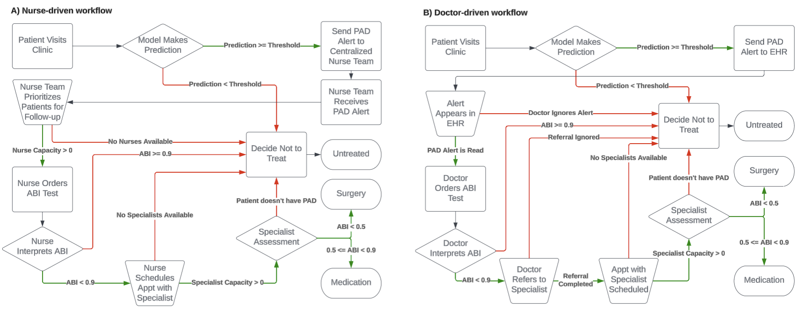
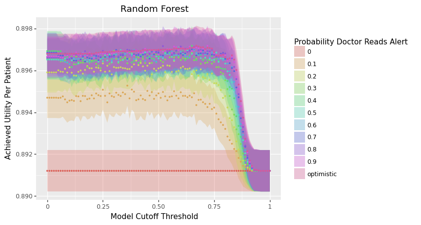
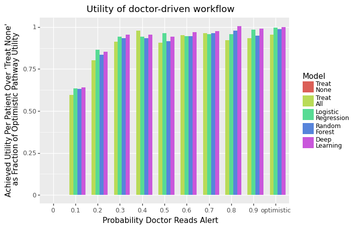
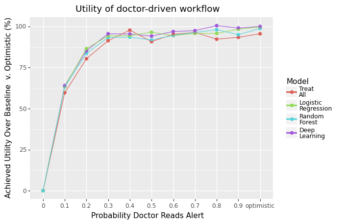

Tutorial (PAD)
================

.. toctree::
   :maxdepth: 2
   :caption: Tutorial (PAD)

In this section, we present a case study of conducting a novel usefulness assessment via APLUS of ML models for the early detection of PAD.

The full ``.ipynb`` notebook for this tutorial can be found `at this link <https://github.com/som-shahlab/aplusml/blob/main/tutorials/pad.ipynb>`_.

🏥 Clinical Motivation
----------------------

PAD is a chronic condition which occurs when the arteries in a patient's limbs are constricted by atherosclerosis, thereby reducing blood flow.
A total of 8–12 million people in the US have PAD. Left untreated, PAD is associated with a higher risk of mortality, serious cardiovascular events, and lower quality of life. This costs the US healthcare system over $21 billion annually.

Despite these risks, PAD is often missed by healthcare providers as roughly half of all PAD patients are asymptomatic. 

Thus, developing methods for the early detection of PAD can help reduce the burden of PAD on the US healthcare system.

🤖 ML Models
-------------
`Ghanzouri et al. 2022 <https://www.nature.com/articles/s41598-022-17180-5>`_ proposed three ML models to classify patients for PAD based on EHR data: a deep learning model, a random forest, and a logistic regression with respective AUROCs of 0.96, 0.91 and 0.81. Each model assigns a probabilistic risk score to each visiting patient which indicates their likelihood of having PAD. 

We use APLUS to conduct a usefulness assessment on incorporating this model into clinical decision making at Stanford Health Care to quantify the benefits of deploying this model in practice.

👩‍⚕️ Workflows
----------------

Based on interviews with practitioners, we identified two workflows to consider:

1. A **nurse-driven** workflow which assumes the existence of a centralized team of nurses reviewing the PAD model's predictions for all patients visiting their clinic each day. This nursing staff decides which patients to directly refer to the specialist, thus cutting out any intermediate steps with a non-specialist physician. The main constraints on this workflow are the capacity of the nursing staff and the specialist's schedule. 
2. A **doctor-driven** workflow which assumes that the PAD model's predictions appear as a real-time alert in a patient's EHR during their visit to the clinic. If the attending physician notices this alert, she can choose to either ignore the alert or act on it. We assume that physicians ignore alerts at random. The main constraints on this workflow are the probability that the attending physician reads the alert (previous studies have shown that up to 96 % of alerts are overridden [54], [55], [56]) and the specialist's schedule.

In both workflows, we assume the existence of a downstream cardiovascular specialist who evaluates patients after they are referred by a doctor or nurse. 
We assume that the specialist has a set capacity for how many patients she can see per day. 
However, once a patient reaches the specialist, we assume that the specialist makes the optimal treatment decision for that patient.

We model 3 possible end outcomes for patients: **Untreated**, **Medication**, or **Surgery.** 

An important distinction between the **nurse-driven** and **doctor-driven** workflows is that the nurse-driven workflow is centralized whereas the doctor-driven workflow is decentralized.
In other words, the nurse-driven workflow batches together all model predictions for each day before patients are chosen for follow-up, while in the doctor-driven workflow each doctor decides whether to act on a PAD alert immediately upon receipt of the alert (independent from the decisions of other doctors). 
Thus, we consider two possible strategies that the nurses can leverage for processing this batch of predictions: (1) ranked screening, in which the nursing staff follows up with the K patients with the highest PAD risk scores; or (2) thresholded screening, in which a random subset of patients are selected from the batch of predictions whose predicted PAD risk score exceeds some cutoff threshold.

The corresponding YAML workflow specification files are available in the APLUS Github repository.

𝓧 Variables
------------

We now need to define the variables (i.e. parameters) that we will use to simulate our workflow. These knobs can be turned to simulate different workflow settings.

First, let's define **simulation-level variables** that will determine how the overall simulation runs.

We need to choose the **timestep** :math:`\Delta t` of the simulation. The simulation runs one timestep at a time, so setting this timestep to the appropriate unit of time is important.

For PAD, the workflow occurs over the span of weeks / months. Thus, we will set the timestep to represent 1 day.

Next, we need to choose the **length**  :math:`T` in timesteps of the simulation. We'll arbitrarily use :math:`T = 500` days. Longer values will result in more precise utility estimates, but will also take longer to run.

We assume we have a dataset of :math:`N` patients, indexed by :math:`i = 1, \ldots, N`.

Second, we need to define the **individual-level properties** of each patient.

Each patient either has PAD (:math:`y_i = 1`) or does not (:math:`y_i = 0`).

Each patient has an individual-level ABI score :math:`a_i`.

* For patients with PAD, we assume that :math:`a_i | y_i = 1 \sim \text{Normal}(0.65, 0.15)`.
* For patients without PAD, we assume that :math:`a_i | y_i = 0 \sim \text{Normal}(1.09, 0.11)`.

These numbers were based on a literature review of the ABI score distribution in patients with and without PAD.

Third, let's define the **utility values** for each of the three workflow outcomes (**Untreated**, **Medication**, **Surgery**).

For example, **Untreated** is the best option for patients without PAD but has the largest cost for patients with PAD. **Medication** is the ideal outcome for patients with moderate PAD but is undesirable for patients without PAD.  **Surgery** is the costliest outcome for all patients, but the relatively best option for patients with severe PAD. 

We combined clinician input with utility estimates from `Itoga et al. 2018 <https://pubmed.ncbi.nlm.nih.gov/29930023/>`_ to define the utilities associated with the end outcomes of each workflow in terms of a multiplier on remaining years living to reflect quality-adjustment on lifespan.
Given that a healthy patient with no PAD has a baseline utility of 1, the utilities for different combinations of PAD severity and treatment are shown in the table below:

.. list-table:: Utility Values by PAD Severity and Treatment
   :header-rows: 1
   :widths: 25 25 25 25

   * - 
     - Untreated
     - Medication
     - Surgery
   * - No PAD
     - 1.0
     - 0.95
     - 0.7
   * - Moderate PAD
     - 0.85
     - 0.9
     - N/A
   * - Severe PAD
     - 0.6
     - N/A
     - 0.68
    
Fourth, we need to define the **capacity constraints** on our workflow.

Both workflows have a constraint on the number of patients that the specialist can see per day, which we define as :math:`c`. We assume that :math:`c = 2` and that it decrements by 1 with each patient the specialist sees, but reset to 2 at the end of each timestep.

For the nurse-driven workflow, we have the following specific constraint...

    * :math:`k` = Number of patients per day that the centralized nursing team can follow-up with for an ABI test

For the doctor-driven workflow, we have the following specific constraint...

    * :math:`p` = Probability that a PAD alert is read

We will vary the values of :math:`k`, :math:`p`, and :math:`c` in our script to simulate different levels of capacity and quantify the utility achieved by the ML models under each.

💽 Data
-------
We acquired a dataset of 4,452 patients who had both ground-truth labels of PAD diagnosis and risk score predictions from all three ML models developed in Ghanzouri et al. 2022.

We simulated 500 consecutive days of patient visits. We sampled :math:`k \sim \text{Poisson}(35)` to determine the number of patients visiting on a given day, then sampled :math:`k` patients with replacement from our dataset.

🔧 Creating the APLUS Config
----------------------------

Let's now create our config files, one for each workflow. We'll walk through creating the **doctor-driven** workflow YAML below, but an example of the full nursing workflow can be found here: https://github.com/som-shahlab/aplusml/blob/main/workflows/pad_nurse.yaml

1. Patient Properties CSV
^^^^^^^^^^^^^^^^^^^^^^^^^

First, we need to create a CSV file that contains **individual-level properties** associated with each patient that will be run through our simulation. Each row in the CSV is a unique patient, and each column is a property.
Properties can be anything -- e.g. demographic information, model predictions, clinical measurements, etc.

This file can contain any columns. In our case, we have the following columns:

* ``id``: The **unique identifier** for the patient.
* ``y``: The **ground truth** PAD status of the patient.
* ``y_hat_dl``: The predicted PAD risk score from the **deep learning** model.
* ``y_hat_rf``: The predicted PAD risk score from the **random forest** model.
* ``y_hat_lr``: The predicted PAD risk score from the **logistic regression** model.
* ``abi_test_pred``: The **predicted** ABI score from the ABI test.
* ``random_resource_priority``: A random number that we will use to **sort patients** when prioritizing them for access to a finite resource.

Here is an excerpt from our properties CSV (which we'll store in ``./patient_properties.csv``):

.. code-block:: text

   id,y,y_hat_dl,y_hat_rf,y_hat_lr,abi_test_pred,random_resource_priority
   1,0,0.95,0.9,0.85,0.9,0.1
   2,1,0.85,0.8,0.75,0.8,0.2
   3,0,0.75,0.7,0.65,0.7,0.3

2. ``Metadata`` Section of Config YAML
^^^^^^^^^^^^^^^^^^^^^^^^^^^^^^^^^^^^^^^

First, we define the **Metadata section** for our workflow. We need to provide the following metadata for our simulation:

  * ``name``: Name of the workflow.
  * ``path_to_properties``: Path to the **Patient Properties CSV file** where each row is a patient, and each column is a property of that patient.
  * ``properties_col_for_patient_id``: The name of the **column** within the properties CSV file that contains the patient IDs.
  * ``patient_sort_preference_property``: The name of the the **variable** that we will use to sort patients when prioritizing them to access a finite resource. Use the ``is_ascending`` flag to specify whether the variable should be sorted in ascending or descending order.

For our **doctor-driven** workflow, our config YAML file's **Metadata section** looks like this:

.. code-block:: yaml

  metadata:
    name: "PAD (Doctor)"
    path_to_properties: "./patient_properties.csv"
    properties_col_for_patient_id: "id"
    patient_sort_preference_property:
      variable: random_resource_priority
      is_ascending: False

3. ``Parameters`` Section of Config YAML
^^^^^^^^^^^^^^^^^^^^^^^^^^^^^^^^^^^^^^^^

Second, we need to define the **Variables section** of our config YAML file. This section contains the parameters that we will use to simulate our workflow.

Let's start by defining the utility values for each possible outcome. Let's define a variable called ``qaly`` to be a dictionary that maps each possible outcome to a utility value. 

.. code-block:: yaml
  
  variables:
    # Utility values
    qaly:
      value: {
        'YES_pad__UNTREATED__needs_surgery' : 0.6,
        'YES_pad__YES_surgery' : 0.68,
        'NO_pad__YES_surgery' : 0.7,
        'YES_pad__UNTREATED__needs_medication' : 0.85,
        'YES_pad__YES_medication' : 0.9,
        'NO_pad__YES_medication' : 0.95,
        'NO_pad__UNTREATED' : 1,
      }

Next, we need to define the parameters that we will use to simulate our workflow.

Because our model outputs probabilistic predictions, we need to define a threshold above which we flag the patient as having PAD. 
By defining this threshold as a variable, we can easily change it in our simulation to evaluate the model's utility at different thresholds. 

Here, we use a variable with ``type: scalar``.
This tells APLUS that the value of this variable is independent of the patient (i.e. it will be the same for all patients).
We can set ``value`` to any Python expression.

We'll set it to 0.5 for now, but we can change this programatically in our simulation.

.. code-block:: yaml
  
  variables:
    # ... existing variables ...
    # Model
    model_threshold:
      type: scalar
      value: 0.5

The default ``type`` for a variable is ``scalar``, so we can equivalently write this variable as:

.. code-block:: yaml

  variables:
    # ... existing variables ...
    # Model
    model_threshold:
      value: 0.5

We'll next add the patient properties from the **Patient Properties CSV** into our simulation.

We'll start with the columns that contain the model predictions and ground truth labels.

Here, we use a variable with ``type: property``.
This tells APLUS that for each patient, we will set the value of this variable to the value of that patient's row in the CSV column named ``column``.

Typically, the name of the variable will be the same as the name of the column in the CSV, as shown below.

.. code-block:: yaml

  variables:
    # ... existing variables ...
    # Patient properties
    y:
      type: property
      column: y
    y_hat_dl:
      type: property
      column: y_hat_dl
    y_hat_rf:
      type: property
      column: y_hat_rf
    y_hat_lr:
      type: property
      column: y_hat_lr

We'll next add a column that contains a random nonce that will be used to deterministically (but randomly) prioritize patients for limited resources.

.. code-block:: yaml

  variables:
    # ... existing variables ...
    # Patient properties
    random_resource_priority: # Random nonce used to deterministically (but randomly) prioritize patients for limited resources
      type: property
      column: random_resource_priority

We'll next consider the ABI test. Recall from our **Patient Properties CSV** that we have a column called ``abi_test_pred``. 
This column contains the predicted ABI score for each patient. 
This will give every patient a property called ``abi_test_pred`` that contains the ABI score contained in their row's ``abi_test_pred`` column.

.. code-block:: yaml
  
  variables:
    # ... existing variables ...
    # ABI test
    abi_test_pred:
      type: property
      column: abi_test_pred

Given this ABI test result, we need to decide how it impacts the patient's care. 
We'll define variables to control the thresholds for each possible decision based on the ABI test result. 
Because these will thresholds will be the same across patients, we will use variables of ``type: scalar`` to represent them.

.. code-block:: yaml
  
  variables:
    # ... existing variables ...
    # ABI test
    abi_test_threshold:
      value: 0.9 # If abi_test_pred < value, then patient tested positive for PAD
    abi_test_specialist_recommend_surgery_threshold:
      value: 0.45 # If abi_test_pred < value, then a specialist will recommend surgery for this patient
    abi_test_untreated_needs_surgery_threshold:
      value: 0.55 # If abi_test_pred < value, then this patient will eventually need surgery for their PAD if they aren't immediately put on medication/surgery
    abi_test_treat_immediately_threshold:
      value: 0.8 # If abi_test_pred > value, then doctor can treat PAD with medication

Finally, we'll add variables for tracking the progress of the simulation over time.

Here, we use a variable with ``type: simulation``. This tells APLUS that these variables are special variables provided by the simulation engine.
Currently, the only supported simulation variables are ``time_already_in_sim`` and ``sim_current_timestep``.

The ``time_already_in_sim`` variable contains the number of timesteps that have elapsed since the specific patient accessing this property started their workflow.

The ``sim_current_timestep`` variable contains the number of timesteps that have elapsed since the simulation started.

.. code-block:: yaml
  
  variables:
    # ... existing variables ...
    # Simulation time
    time_already_in_sim:
      type: simulation
    sim_current_timestep:
      type: simulation

Let's now add variables for representing the **constraints** on our workflow.

The first constraint that we need to model is the **specialist's capacity.**
We'll define a few variables to model this. 

First, we'll define the number of days that the specialist is in office as an array of integers called ``specialist_days_in_office``. 
We'll have 0 represent Sunday and 6 represent Saturday.

.. code-block:: yaml
  
  variables:
    # ... existing variables ...
    # Specialist
    specialist_days_in_office:
      value: [1, 3, 5] # Specialist can only see patients on a MWF

Second, we'll define the number of patients that the specialist can see per day as ``specialist_capacity``.

Here, we use a variable with ``type: resource``.
This tells APLUS that this variable can increase/decrease over time.

We need to specify the following parameters for the resource:

  * ``init_amount``: The initial amount of the resource when the simulation starts.
  * ``max_amount``: The maximum amount of the resource. Any refill attempts that would increase the resource above this amount will simply set the resource to this value.
  * ``refill_amount``: The amount of the resource to add each time it is refilled.
  * ``refill_duration``: The number of timesteps between refills.

.. code-block:: yaml
  
  variables:
    # ... existing variables ...
    # Specialist
    specialist_capacity:
      type: resource
      init_amount: 2 # Specialist can see 2 patients her first day
      max_amount: 2 # Specialist can only see 2 patients per day
      refill_duration: 1 # Specialist "refills" their capacity at the end of each day
      refill_amount: 2 # Every time the specialist refills their capacity, they change it by +2

Third, we'll define the number of days that a patient will be willing to wait to see the specialist (before giving up and ending in the "No Treatment" state) as ``schedule_specialist_appt_time_out``.

.. code-block:: yaml
  
  variables:
    # ... existing variables ...
    # Specialist
    schedule_specialist_appt_time_out: 
      value: 30 # Wait 30 days to find time with specialist, then give up

The **second constraint** that we need to model is the **probability that a PAD alert is read** by the physician.

We'll define a variable called ``prob_pad_alert_is_read`` to represent this. Note that this is uniform across all patients and doctors.

.. code-block:: yaml
  
  variables:
    # ... existing variables ...
    # Transition probs
    prob_pad_alert_is_read:
      value: 0.8

The **third constraint** that we need to model is the **probability that an ABI test is ordered** by the physician for a patient.

We'll define a variable called ``prob_doctor_orders_abi`` to represent this. Again, note that this is uniform across all patients and doctors.

.. code-block:: yaml
  
  variables:
    # ... existing variables ...
    # Transition probs
    prob_doctor_orders_abi:
      value: 0.95

The **fourth constraint** that we need to model is the probability that the patient **successfully schedules a follow-up appointment** with the specialist.

We'll define a variable called ``prob_specialist_follow_up_completed`` to represent this.

.. code-block:: yaml
  
  variables:
    # ... existing variables ...
    # Transition probs
    prob_specialist_follow_up_completed:
      value: 0.8

And that's it! We've now defined all of the variables we need to control our simulation.

4. ``States`` Section of Config YAML
^^^^^^^^^^^^^^^^^^^^^^^^^^^^^^^^^^^^^

Now that we've defined all of the variables that we need, we can define the states of our workflow.

First, we need to define the **start** state. Only one state can be the start state, and it must be named ``start``.

Each **start** state must have the following fields:
* ``type``: ``start``
* ``label``: The label of the state.
* ``transitions``: A list of transitions that can be made from the current state. Each transition must have a ``dest`` field that specifies the state to transition to. If only one transition is specified, it will always be taken.

For PAD, our patients will immediately be admitted into the clinic, so our start state will have the following transition:

.. code-block:: yaml

  states:
    start:
      type: start
    label: "Start"
    transitions:
      - dest: admit

Let's now define the **admit** state. 
We will immediately make a model prediction for each patient who visits the clinic, so let's immediately transition to the **model_pred** state.

.. code-block:: yaml

  states:
    # ... existing states ...
    admit:
      label: "Patient Visits Clinic"
      transitions:
      - dest: model_pred

Let's now define the **model_pred** state.

This state will make a model prediction for each patient who visits the clinic, then branch to either the **send_pad_alert** or **no_treatment** state depending on the prediction.

To represent a conditional transition, we add an ``if`` field to the **send_pad_alert** transition. 

The ``if`` field takes a Python expression that evaluates to a boolean. If the expression evaluates to ``True``, then the transition will be taken.

In this case, the expression is ``y_hat_dl >= model_threshold`` will evaluate to ``True`` if the patient's predicted PAD risk score (``y_hat_dl``) is greater than or equal to the model threshold (``model_threshold``) we've chosen.

This expression is evaluated in the context of the patient's properties, so you can use any of the variables defined in the **Variables section** of the config. In this case, we're using the ``y_hat_dl`` and ``model_threshold`` variables.

Note that the **no_treatment** transition does not have an ``if`` field; it will be taken by default if the **send_pad_alert** transition is not taken.

.. code-block:: yaml

  states:
    # ... existing states ...
    model_pred:
      label: "Make Model Prediction"
      transitions:
        - dest: send_pad_alert
          if: y_hat_dl >= model_threshold
        - dest: no_treatment
    no_treatment:
      label: "Decide Not to Treat"
      transitions:
        - dest: untreated

Let's now define the states that occur when a PAD alert is sent to the EHR.
First, we define the **send_pad_alert** state to represent the alert being sent to the EHR. This state leads to the **doctor_presented_with_alert** state, which represents the alert appearing in the EHR.

.. code-block:: yaml

  states:
    # ... existing states ...
    send_pad_alert:
      label: "Send PAD Alert to EHR"
      transitions:
      - dest: doctor_presented_with_alert
    doctor_presented_with_alert:
      label: "Alert Appears in EHR"
      transitions:
        - dest: doctor_reads_alert
          prob: prob_pad_alert_is_read       
        - dest: no_treatment

As shown above, the **doctor_presented_with_alert** state has a conditional transition. This time, however, the conditional transition is based on a simple probability rather than a Python expression.
Thus, we use the ``prob`` field to specify the probability of transitioning to the **doctor_reads_alert** state.
If the probability is not met, then the transition to the **no_treatment** state will be taken by default.

Let's now define the states that occur when the doctor reads the alert.
This state will order an ABI test for the patient if the doctor reads the alert, then branch to either the **order_abi** or **no_treatment** state based on a probability defined in the **Variables section** of the config.

.. code-block:: yaml

  states:
    # ... existing states ...
    doctor_reads_alert:
      label: "Doctor Reads Alert"
      transitions:
        - dest: order_abi
          prob: prob_doctor_orders_abi
        - dest: no_treatment

Let's now define the states that occur when the doctor orders an ABI test. Those are shown below, which include a mix of probabilitistic and expression-based conditional transitions.
Note that the ``if`` fields can support arbitrarily complicated Python expressions (e.g. ``(abi_test_treat_immediately_threshold < abi_test_pred) and (abi_test_pred <= abi_test_threshold)``).

.. code-block:: yaml

  states:
    # ... existing states ...
    order_abi:
      label: "Doctor Orders ABI Test"
      transitions:
        - dest: doctor_interprets_abi_result
    doctor_interprets_abi_result:
      label: "Doctor Interprets ABI"
      transitions:
        - dest: doctor_treats_immediately
          if: (abi_test_treat_immediately_threshold < abi_test_pred) and (abi_test_pred <= abi_test_threshold)
        - dest: refer_to_specialist
          if: abi_test_pred < abi_test_threshold
        - dest: no_treatment
    doctor_treats_immediately:
      label: "Doctor Treats Immediately"
      transitions:
        - dest: medication
    refer_to_specialist:
      label: "Doctor Refers to Specialist"
      transitions:
        - dest: schedule_specialist_appt
          prob: prob_specialist_follow_up_completed
        - dest: no_treatment

Let's now define the states that occur when the doctor schedules a follow-up appointment with the specialist.
This state will schedule an appointment with the specialist if the patient has capacity and the current day is a specialist day, then branch to either the **specialist_review** or **no_treatment** state depending on the result of the ABI test.

.. code-block:: yaml

  states:
    # ... existing states ...
    schedule_specialist_appt:
      label: "Schedule Appt with Specialist"
      transitions:
        - dest: specialist_review
          if: (specialist_capacity > 0) and (sim_current_timestep % 7 in specialist_days_in_office)
          resource_deltas: 
            specialist_capacity: -1
        - dest: no_treatment
          if:  time_already_in_sim >= schedule_specialist_appt_time_out - 1
        - dest: schedule_specialist_appt
          duration: 1
    specialist_review:
      label: "Specialist Assessment"
      transitions:
        - dest: no_treatment
          if: y == 0
        - dest: surgery
          if: abi_test_pred < abi_test_specialist_recommend_surgery_threshold
        - dest: medication

Finally, let's define the terminal states in which a patient can end the workflow. For each terminal state, we must specify the following fields:
* ``type``: ``end``
* ``label``: The label of the state.

And we can optionally specify the following fields:
* ``utilities``: A list of utility values for the state. Each utility value must have a ``value`` field that specifies the utility value (this can be a variable), and a ``unit`` field that specifies the unit of the utility value. It can also optionally have an ``if`` field that specifies the condition under which the utility value is used.

Let's start with the **medication** state, which means the patient is treated with medication. We have two situations to model:

1. The patient *has PAD* (i.e. ``y == 1``) and is treated with medication. The utility for this is given by the variable ``qaly["YES_pad__YES_medication"]``.
2. The patient *does not have PAD* (i.e. ``y == 0``) and is treated with medication. The utility for this is given by the variable ``qaly["NO_pad__YES_medication"]``.

Putting this together, we get the following definition for the **medication** state:

.. code-block:: yaml

  states:
    # ... existing states ...
    medication:
      type: end
      label: "Medication"
      utilities:
        - value: qaly["YES_pad__YES_medication"]
          if: y == 1
          unit: qaly
        - value: qaly["NO_pad__YES_medication"]
          if: y == 0
          unit: qaly

We can repeat this process for the **surgery** and **untreated** states.

.. code-block:: yaml

  states:
    # ... existing states ...
    surgery:
      type: end
      label: "Surgery"
      utilities:
        - value: qaly["YES_pad__YES_surgery"]
          if: y == 1
          unit: qaly
        - value: qaly["NO_pad__YES_surgery"]
          if: y == 0
          unit: qaly
    untreated:
      label: "Untreated"
      type: end
      utilities:
        - value: qaly["YES_pad__UNTREATED__needs_surgery"]
          if: y == 1 and (abi_test_pred < abi_test_untreated_needs_surgery_threshold)
          unit: qaly
        - value: qaly["YES_pad__UNTREATED__needs_medication"]
          if: y == 1 and not (abi_test_pred < abi_test_untreated_needs_surgery_threshold)
          unit: qaly
        - value: qaly["NO_pad__UNTREATED"]
          if: y == 0
          unit: qaly

And we're done!
We've now defined the entire **doctor-driven workflow** for our simulation.

The full config file is shown below for reference.

.. code-block:: yaml

  metadata:
    name: "PAD (Doctor)"
    path_to_properties: "input/pad/properties.csv"
    patient_sort_preference_property:
      variable: random_resource_priority
      is_ascending: False

  variables:
    # Model
    model_threshold:
      value: 0.5
    # ABI test
    abi_test_threshold:
      value: 0.9 # If abi_test_pred < X, then patient tested positive for PAD
    abi_test_specialist_recommend_surgery_threshold:
      value: 0.45 # If abi_test_pred < X, then a specialist will recommend surgery for this patient
    abi_test_untreated_needs_surgery_threshold:
      value: 0.55 # If abi_test_pred < X, then this patient will eventually need surgery for their PAD if they aren't immediately put on medication/surgery
    abi_test_pred:
      type: property
      column: abi_test_pred
    abi_test_treat_immediately_threshold:
      value: 0.8 # If abi_test_pred > X, then doctor can treat PAD with medication
    # Transition probs
    prob_pad_alert_is_read:
      value: 0.8
    prob_doctor_orders_abi:
      value: 0.95
    prob_specialist_follow_up_completed:
      value: 0.8
    # Specialist
    schedule_specialist_appt_time_out: 
      value: 30 # Wait 30 days to find time with specialist, then give up
    specialist_days_in_office:
      value: [1, 3, 5] # Specialist can only see patients on a MWF
    specialist_capacity:
      type: resource
      init_amount: 2
      max_amount: 2 # Specialist can only see 2 patients per day
      refill_amount: 2
      refill_duration: 1
    # Patient properties
    y:
      type: property
      column: y
    y_hat_dl:
      type: property
      column: y_hat_dl
    y_hat_rf:
      type: property
      column: y_hat_rf
    y_hat_lr:
      type: property
      column: y_hat_lr
    random_resource_priority: # Random nonce used to deterministically (but randomly) prioritize patients for limited resources
      type: property
      column: random_resource_priority
    time_already_in_sim:
      type: simulation
    sim_current_timestep:
      type: simulation
    # Utilities
    qaly:
      value: {
        'YES_pad__UNTREATED__needs_surgery' : 0.6,
        'YES_pad__YES_surgery' : 0.68,
        'NO_pad__YES_surgery' : 0.7,
        'YES_pad__UNTREATED__needs_medication' : 0.85,
        'YES_pad__YES_medication' : 0.9,
        'NO_pad__YES_medication' : 0.95,
        'NO_pad__UNTREATED' : 1,
      }

  states:
    start:
      type: start
      label: "Start"
      transitions:
        - dest: admit
    admit:
      label: "Patient Visits Clinic"
      transitions:
        - dest: model_pred
    model_pred:
      label: "Make Model Prediction"
      transitions:
        - dest: send_pad_alert
          if: y_hat_dl >= model_threshold
        - dest: no_treatment
    send_pad_alert:
      label: "Send PAD Alert to EHR"
      transitions:
        - dest: doctor_presented_with_alert
    doctor_presented_with_alert:
      label: "Alert Appears in EHR"
      transitions:
        - dest: doctor_reads_alert
          prob: prob_pad_alert_is_read       
        - dest: no_treatment
    doctor_reads_alert:
      label: "Doctor Reads Alert"
      transitions:
        - dest: order_abi
          prob: prob_doctor_orders_abi
        - dest: no_treatment
    order_abi:
      label: "Doctor Orders ABI Test"
      transitions:
        - dest: doctor_interprets_abi_result
    doctor_interprets_abi_result:
      label: "Doctor Interprets ABI"
      transitions:
        - dest: doctor_treats_immediately
          if: (abi_test_treat_immediately_threshold < abi_test_pred) and (abi_test_pred <= abi_test_threshold)
        - dest: refer_to_specialist
          if: abi_test_pred < abi_test_threshold
        - dest: no_treatment
    doctor_treats_immediately:
      label: "Doctor Treats Immediately"
      transitions:
        - dest: medication
    refer_to_specialist:
      label: "Doctor Refers to Specialist"
      transitions:
        - dest: schedule_specialist_appt
          prob: prob_specialist_follow_up_completed
        - dest: no_treatment
    schedule_specialist_appt:
      label: "Schedule Appt with Specialist"
      transitions:
        - dest: specialist_review
          if: (specialist_capacity > 0) and (sim_current_timestep % 7 in specialist_days_in_office)
          resource_deltas: 
            specialist_capacity: -1
        - dest: no_treatment
          if:  time_already_in_sim >= schedule_specialist_appt_time_out - 1
        - dest: schedule_specialist_appt
          duration: 1
    specialist_review:
      label: "Specialist Assessment"
      transitions:
        - dest: no_treatment
          if: y == 0
        - dest: surgery
          if: abi_test_pred < abi_test_specialist_recommend_surgery_threshold
        - dest: medication
    no_treatment:
      label: "Decide Not to Treat"
      transitions:
        - dest: untreated
    medication:
      type: end
      label: "Medication"
      utilities:
        - value: qaly["YES_pad__YES_medication"]
          if: y == 1
          unit: qaly
        - value: qaly["NO_pad__YES_medication"]
          if: y == 0
          unit: qaly
    surgery:
      type: end
      label: "Surgery"
      utilities:
        - value: qaly["YES_pad__YES_surgery"]
          if: y == 1
          unit: qaly
        - value: qaly["NO_pad__YES_surgery"]
          if: y == 0
          unit: qaly
    untreated:
      label: "Untreated"
      type: end
      utilities:
        - value: qaly["YES_pad__UNTREATED__needs_surgery"]
          if: y == 1 and (abi_test_pred < abi_test_untreated_needs_surgery_threshold)
          unit: qaly
        - value: qaly["YES_pad__UNTREATED__needs_medication"]
          if: y == 1 and not (abi_test_pred < abi_test_untreated_needs_surgery_threshold)
          unit: qaly
        - value: qaly["NO_pad__UNTREATED"]
          if: y == 0
          unit: qaly

And the config file for the **nurse-driven workflow** can be found at this link: https://github.com/som-shahlab/aplusml/blob/main/workflows/pad_nurse.yaml

📏 Baselines
-------------

We evaluated each PAD model's utility relative to three baselines: 

* **Treat None** -- We simply predict a PAD risk score of 0 for all patients; 
* **Treat All** -- We predict a PAD risk score of 1 for all patients; 
* **Optimistic** -- There were no workflow constraints or resource limits

Concretely, we measured each model's expected utility achieved per patient above the **Treat None** baseline as a percentage of the utility achieved under the **Optimistic** scenario. In other words, we measured how much of the total possible utility gained from using a model was actually achieved under each workflow's constraints, relative to simply doing nothing. 

📊 Run Simulation
-----------------

Let's now write some code to run the simulation and plot the results!

First, load the necessary libraries and define the paths to the files we need.

.. code-block:: python

  import os
  import copy
  import pickle
  import numpy as np
  from matplotlib import cm
  import matplotlib.patches as mpatches
  import matplotlib.pyplot as plt
  import pandas as pd
  from typing import List
  import aplusml
  import pad

  # Patient properties + model predictions
  PATH_TO_OUTPUT_FOLDER = '../output/'
  PATH_TO_PATIENT_PROPERTIES = '../input/synthetic_pad_inputs.csv'
  os.makedirs(PATH_TO_OUTPUT_FOLDER, exist_ok=True)

  # Workflow config YAML file
  PATH_TO_DOCTOR_YAML = '../workflows/pad_doctor.yaml'

Next, set the models and thresholds we want to test.

.. code-block:: python
  
  # Model settings
  THRESHOLDS = np.linspace(0, 1, 101) # Test model thresholds from 0 to 1
  MODELS = ['dl', 'rf', 'lr'] # Test the three models

Next, load the doctor-driven workflow config YAML file and display the workflow diagram.

.. code-block:: python

  # Load nurse-driven workflow
  simulation = aplusml.Simulation.create_from_yaml(PATH_TO_DOCTOR_YAML, PATH_TO_PATIENT_PROPERTIES)
  simulation.draw_workflow_diagram(figsize=(30,30))

Finally, define some helper functions to help us run the simulation...

.. code-block:: python

  # Helper function to run the simulation and plot the results
  def run_test(patients: List[aplusml.Patient],
              labels: List[str], 
              settings: List[dict], 
              MODELS: List[str],
              THRESHOLDS: List[float],
              PATH_TO_YAML: str,
              PATH_TO_PROPERTIES: str,
              is_patient_sort_by_y_hat: bool = False,
              func_setup_optimistic: Callable = None,
              is_use_multi_processing: bool = True) -> Tuple[dict, dict]:
    model_2_result = {} # [key] = model name, [value] = df
    for m in MODELS:
        simulation = load_simulation_for_model(PATH_TO_YAML, 
                                               PATH_TO_PROPERTIES, 
                                               m, 
                                               is_patient_sort_by_y_hat=is_patient_sort_by_y_hat, 
                                               func_setup_optimistic=func_setup_optimistic)
        df_result = aplusml.run_test(simulation, 
                                      patients,
                                      labels + [f"optimistic"], settings + [{}],
                                      pd.DataFrame(),
                                      lambda sim, patients, label: aplusml.test_diff_thresholds(sim, patients, THRESHOLDS, utility_unit='qaly'),
                                      is_use_multi_processing=is_use_multi_processing)
        model_2_result[m] = df_result.copy()

    # Save Treat All / None / Perfect baselines under optimistic conditions
    baselines = [
        # Treat All - treat everyone as if y_hat == 1
        { 'label' : 'all', 'if_' : True },
        # Treat None - treat everyone as if y_hat == 0
        { 'label' : 'none', 'if_' : False },
        # Treat Perfect - treat everyone as if y_hat == y
        { 'label' : 'perfect', 'if_' : 'y == 1' },
    ]
    baseline_2_result = {}
    for b in baselines:
        label = b['label']
        if_ = b['if_']
        # This is INDEPENDENT of any model (MODELS[0] used for simplicity here)
        simulation = load_simulation_for_model(PATH_TO_YAML, PATH_TO_PROPERTIES, MODELS[0], is_patient_sort_by_y_hat=False, func_setup_optimistic=func_setup_optimistic)
        simulation.states['model_pred'].transitions[0].if_ = if_
        # This only has one threshold (at 0) since this is independent of the model (and thus the threshold of the model)
        df_result = aplusml.run_test(simulation, patients,
                                labels + [f"optimistic"], settings + [{}],
                                pd.DataFrame(),
                                lambda sim, patients, label: aplusml.test_diff_thresholds(sim, patients, [0], utility_unit='qaly'),
                                is_use_multi_processing=is_use_multi_processing)
        baseline_2_result[label] = df_result.copy()
    return model_2_result, baseline_2_result

Add some functions to help us plot the results...

.. code-block:: python

  def show_ribbon_plots(model_2_result, label_sort_order, label_title):
    p1 = aplusml.plot.plot_mean_utility_v_threshold('Deep Learning', model_2_result['dl'],
                                                    label_sort_order=label_sort_order,
                                                    label_title=label_title)
    p2 = aplusml.plot.plot_mean_utility_v_threshold('Random Forest', model_2_result['rf'],
                                                    label_sort_order=label_sort_order,
                                                    label_title=label_title)
    p3 = aplusml.plot.plot_mean_utility_v_threshold('Logistic Regression', model_2_result['lr'],
                                                    label_sort_order=label_sort_order,
                                                    label_title=label_title)
    print(p1)
    print(p2)
    print(p3)

  def show_dodged_bar_mean_utility_plot(title: str, df_, label_sort_order, label_title, is_percent_of_optimistic):
    p = aplusml.plot.plot_dodged_bar_mean_utilities(title,
                                                    df_,
                                                    label_sort_order=label_sort_order,
                                                    color_sort_order=[
                                                        'none', 'all', 'lr', 'rf', 'dl', ],
                                                    color_names=[
                                                        'Treat\nNone', 'Treat\nAll', 'Logistic\nRegression', 'Random\nForest', 'Deep\nLearning'
                                                    ],
                                                    is_percent_of_optimistic=is_percent_of_optimistic,
                                                    x_label=label_title)
    print(p)

  def show_line_mean_utility_plot(title: str, df_, label_sort_order, label_title, is_percent_of_optimistic):
    df_['group'] = df_['color']
    p = aplusml.plot.plot_line_mean_utilities(title,
                                                df_,
                                                group_sort_order=None,
                                                shape_sort_order=None,
                                                color_title='',
                                                shape_title='',
                                                label_sort_order=label_sort_order,
                                                groups_to_drop=['none', ],
                                                color_sort_order=['all', 'lr', 'rf', 'dl', ],
                                                color_names=[
                                                    'Treat\nAll', 'Logistic\nRegression', 'Random\nForest', 'Deep\nLearning'
                                                ],
                                                is_percent_of_optimistic=is_percent_of_optimistic,
                                                x_label=label_title)

    print(p)

  def show_plots(title, model_2_result, df_, label_sort_order, label_title,
                is_show_ribbon_plot: bool = True,
                is_show_dodged_bar_plot: bool = True,
                is_show_line_plot: bool = True): 
    
    # Ribbon plot
    if is_show_ribbon_plot:
        show_ribbon_plots(model_2_result, label_sort_order, label_title)

    # Dodged bar mean utility plot
    if is_show_dodged_bar_plot:
        show_dodged_bar_mean_utility_plot(title, df_, label_sort_order, label_title, is_percent_of_optimistic=1)
    
    # Line mean utility plot
    if is_show_line_plot:
        show_line_mean_utility_plot(title, df_, label_sort_order, label_title, is_percent_of_optimistic=1)

  # Helper function to plot the results
  def plot_helper(model_2_result: dict, 
                baseline_2_result: dict,
                threshold: float = None) -> pd.DataFrame:
    """Convert `model_2_result` and `baseline_2_result` dicts into unified dfs
    If `threshold` is not specified, choose `threshold` that achieves max `mean_utility`
    """    
    plot_avg_utilities = []
    for m, df in model_2_result.items():
        for label in df['label'].unique():
            if threshold:
                y = df[(df['label'] == label) & (df['threshold'] == threshold)]['mean_utility'].values[0]
                y_sem = df[(df['label'] == label) & (df['threshold'] == threshold)]['sem_utility'].values[0]
            else:
                max_idx = df[df['label'] == label]['mean_utility'].argmax()
                y = df[df['label'] == label].iloc[max_idx]['mean_utility']
                y_sem = df[df['label'] == label].iloc[max_idx]['sem_utility']
            plot_avg_utilities.append({
                'label' : label,
                'y' : y,
                'y_sem' : y_sem,
                'model' : m,
            })
    for m, df in baseline_2_result.items():
        plot_avg_utilities += [{
                'label' : row['label'],
                'y' : row['mean_utility'],
                'y_sem' : 0,
                'model' : m,
            } for idx, row in df.iterrows() ]
    df_avg_utilities = pd.DataFrame(plot_avg_utilities)
    return df_avg_utilities

Finally, define a function to help us run the simulation...

.. code-block:: python

  # Run the simulation
  def simulate_doctor_workflow(patients: List[aplusml.Patient],
                            values: list,
                            specialist_capacity: int = None,
                            is_ranked_screening: bool = True,
                            path_to_yaml: str = None,
                            is_show_ribbon_plot: bool = True,
                            is_show_dodged_bar_plot: bool = True,
                            is_show_line_plot: bool = True):
    settings = [{
        'prob_pad_alert_is_read': {
            'type': 'scalar',
            'value': x,
        },
        'specialist_capacity': {
            'type': 'resource',
            'init_amount': specialist_capacity if specialist_capacity else 1e5,
            'max_amount': specialist_capacity if specialist_capacity else 1e5,
            'refill_amount': specialist_capacity if specialist_capacity else 1e5,
            'refill_duration': 1,
        },
    } for x in values]

    # Run the simulation
    labels = [f"{x}" for x in values]
    model_2_result, baseline_2_result = run_test(patients,
                                                  labels,
                                                  settings,
                                                  MODELS,
                                                  THRESHOLDS,
                                                  path_to_yaml,
                                                  PATH_TO_PATIENT_PROPERTIES,
                                                  is_patient_sort_by_y_hat=is_ranked_screening,
                                                  func_setup_optimistic=func_setup_optimistic)
    # Plotting constants
    df_ = plot_helper(model_2_result, {
        'all': baseline_2_result['all'],
        'none': baseline_2_result['none']
    }, threshold=0.5).rename(columns={'model': 'color'})
    # Use prob=1 as the 'optimistic' case
    df_ = df_[df_['label'] != 'optimistic']
    df_.loc[df_['label'] == '1', 'label'] = 'optimistic'
    label_sort_order: list[str] = [ str(x) for x in df_['label'].unique() ]
    label_title: str = 'Probability Doctor Reads Alert'
    for m in MODELS:
        model_2_result[m] = model_2_result[m][model_2_result[m]['label'] != 'optimistic']
        model_2_result[m].loc[model_2_result[m]['label'] == '1', 'label'] = 'optimistic'

    show_plots('Utility of doctor-driven workflow', model_2_result, df_, label_sort_order, label_title,
                is_show_ribbon_plot = is_show_ribbon_plot,
                is_show_dodged_bar_plot = is_show_dodged_bar_plot,
                is_show_line_plot = is_show_line_plot)

And finally run our simulation across all the different doctor-driven workflow constraints we want to test!

.. code-block:: python

  # Run simulation
  values = [0, .1, .2, .3, .4, .5, .6, .7, .8, .9, 1, ]

  for specialist_capacity in [None, 2, 5]:
      print(f"==== Thresholded' + {'Specialist Unlimited' if specialist_capacity is None else f'Specialist Cap ({specialist_capacity})'} ====")
      simulate_doctor_workflow(copy.deepcopy(all_patients),
                              values,
                              specialist_capacity=specialist_capacity,
                              is_ranked_screening=False,
                              path_to_yaml=PATH_TO_DOCTOR_YAML)

You should see plots like the following:

